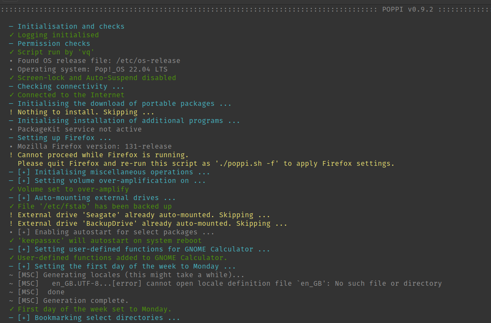

# Pop!_OS Post-Installation (POPPI) Script

POPPI is a highly-customisable set of Bash functions originally developed for and tested on Pop!_OS 22.04 LTS powered by Linux kernel v6.9.3. It will yield the best results when used on a fresh system installation. POPPI is a work in progress and will probably remain so as long as there is a strong interest from the user community.

Currently, POPPI does not support Cosmic DE and has not been tested on other Ubuntu derivatives.


## Table of Contents

- [Features](#features)
- [Usage](#usage)
  - [1. Get the script](#1-get-the-script)
  - [2. Setup the JSON configuration file `configure.pop`](#2-setup-the-json-configuration-file-configurepop)
  - [3. Prepare your files](#3-prepare-your-files)
  - [4. Run the script](#4-run-the-script)
- [Default external portables and repositories](#default-external-portables-and-repositories)
- [Issues and Help](#issues--help)

## Features

* [Installs portable, .DEB, and source packages](#default-external-portables-and-repositories)
* [Adds repositories](#default-external-portables-and-repositories)
* [Configures Firefox](#section-firefox)
* [Sets your browser's privacy environment (thanks to Arkenfox)](#section-firefox)
* [Automounts external drives by label](#section-miscops)
* [Bookmarks select directories to GNOME Files/Nautilus](#section-miscops)
* [Adds custom user avatar on login page](#section-miscops)
* [Adds custom cronjobs](#section-miscops)
* [Downloads, installs, and configures GNOME extensions](#section-miscops)
* [Adds favourite packages to dock](#section-miscops)
* [Adds custom formulas to GNOME Calc](#section-miscops)
* [Sets custom GNOME settings through GNOME's native GSettings](#section-miscops)
* [Downloads and installs external fonts](#section-miscops)
* [Copies and/or downloads wallpapers from external sources](#section-miscops)
* [Performs other tweaks...](#section-miscops)





## Usage

### 1. Get the script

#### Using the latest stable version (Recommended)

```console
wget https://github.com/simurq/poppi/releases/latest/download/poppi.sh -O poppi.sh
chmod +x ./poppi.sh
```

#### Using the latest `development` branch

```console
wget https://raw.githubusercontent.com/simurq/poppi/poppi-dev/poppi.sh -O poppi.sh
chmod +x ./poppi.sh
```


### 2. Setup the JSON configuration file `configure.pop`

The JSON configuration file `configure.pop` is a key component of POPPI. It is where you'll spend most of your time, adjusting POPPI's workflow to your individual needs. The script will read all the user settings from this file. You're strongly encouraged to modify the configuration file instead of making direct edits to the script.

By default, a new configuration file will be created in the same directory where you run the script, if one is not already there. You can then make necessary changes to the file. Both files—`configure.pop` and `poppi.sh`—should be in the same directory to make POPPI run properly. A detailed explanation of the JSON key/value pairs found in `configure.pop` is provided below.


#### Section `GENERAL`

This section specifies general settings pertinent to the script itself.

<table>
<tr>
<td><b>Option</b>/td>
<td><b>Description</b></td>
</tr>
<tr>
<td>

```json
"gen.colour_head": "rgb(72,185,199)"
```

</td>
<td>sets the colour of headings in RGB* format (default=<b>#48b9c7</b>)
</tr>
<tr>
<td>

```json
"gen.colour_info": "#949494"
```

</td>
<td>sets the colour of info messages in HEX format (default=<b>#949494</b>).</td>
</tr>
<tr>
<td>

```json
"gen.colour_okay": "rgb(78,154,10)"
```

</td>
<td>sets the colour of messages indicating the successful completion of an operation in RGB format (default=<b>#4e9a0a</b>).</td>
</tr>
<tr>
<td>

```json
"gen.colour_stop": "#ff3232"
```

</td>
<td>sets the colour of error messages in HEX format (default=<b>#ff3232</b>).</td>
</tr>
<tr>
<td>

```json
"gen.colour_warn": "rgb(240,230,115)"
```

</td>
<td>sets the colour of warning messages in RGB format (default=<b>#f0e673</b>).</td>
</tr>
<tr>
<td>

```json
"gen.logfile_backup_no": "3"
```

</td>
<td>sets the number of logfile backups (default=<b>3</b> | max=99).</td>
</tr>
<tr>
<td>

```json
"gen.logfile_format": "Metric"
```

</td>
<td>sets the textual format of logs (US/Metric | default=<b>Metric</b>).</td>
</tr>
<tr>
<td>

```json
"gen.logfile_on": 1
```

</td>
<td>toggle to enable (default=<b>1</b>)/disable (0) logging.</td>
</tr>
<tr>
<td>

```json
"gen.maximise_window": 1
```

</td>
<td>toggle to maximise (default=<b>1</b>)/disable (0) the main terminal window when running POPPI.</td>
</tr>
<tr>
<td>

```json
"gen.set_timer": 1
```

</td>
<td>toggle to set the timer that calculates the running period of the script in hours, minutes, and seconds (default=<b>1</b>).</td>
</tr>
<tr>
<td>

```json
"gen.test_server": "duckduckgo.com"
```

</td>
<td>sets the server to check the Internet connectivity (default=<b>duckduckgo.com</b>).</td>
</tr>
</table>

**Note:** Text colours for keys `gen.colour_*` accept values both in RGB and HEX format.</td>


#### Section `FIREFOX`

This section covers all the operations with the Firefox browser, including:
* the creation or identification of user profile;
* the download and installation of browser extensions;
* setting user's privacy environment (Arkenfox stuff reinforced with personal [user overrides](https://github.com/arkenfox/user.js/wiki));
* setting the persistent cookies.

<table>
<tr>
<td><b>Option</b></td>
<td><b>Description</b></td>
</tr>
<tr>
<td>

```json
"ffx.configure": 1
```

</td>
<td>toggle to enable (1)/disable (default=<b>0</b>) browser configuration. When disabled, POPPI will skip the browser configuration completely.</td>
</tr>
<tr>
<td>

```json
"ffx.extensions": [
  "groupspeeddial",
  "colorzilla",
  "diigo-web-collector",
  "downloader-4-reddit-redditsave",
  "gnome-shell-integration",
  "keepassxc-browser",
  "tampermonkey",
  "ublock-origin",
  "wikiwand-wikipedia-modernized"
    ]
```

</td>
<td>downloads and installs Firefox extensions provided as a comma-separated array of extension titles. The title of extension must respect the naming convention supported by Mozilla. E.g.: https://addons.mozilla.org/en-US/firefox/addon/<b>wikiwand-wikipedia-modernized</b> (default=<b>nul</b>).</td>
</tr>
<tr>
<td>

```json
"ffx.cookies_to_keep": [
  "https://copilot.microsoft.com",
  "https://discord.com",
  "https://github.com",
  "https://web.telegram.org",
  "https://web.whatsapp.com",
  "https://www.bing.com",
  "https://www.wikiwand.com"
    ]
```

</td>
<td>sets persistent cookies for select websites provided as a comma-separated array of website URLs (default=<b>nul</b>).</td>
</tr>
<tr>
<td>

```json
"ffx.set_privacy": 1
```

</td>
<td>enables privacy, security, and anti-tracking options as specified in <a href="https://github.com/arkenfox/user.js">Arkenfox's</a> JavaScript addon (default=<b>1</b>).</td>
</tr>
<tr>
<td>

```json
"ffx.set_homepage": 0
```

</td>
<td>sets browser homepage to <a href="https://addons.mozilla.org/en-US/firefox/addon/groupspeeddial">GroupSpeedDial</a>, if the latter is installed (see: <code>"ffx.extensions"</code>). Otherwise the setting is ineffective. This is one of the options that can be modified either by the user or by request (default=<b>0</b>).</td>
</tr>
<tr>
</table>


#### Section `PACKAGES`

This section provides a number of options for setting and configuring portable and installable packages.

<table>
<tr>
<td><b>Option</b></td>
<td><b>Description</b></td>
</tr>
<tr>
<td>

```json
"pkg.autostart": [
  "keepassxc"
    ]
```

</td>
<td>sets the indicated package to autostart on system reboot (e.g., KeePassXC). The title of the package must match the one provided under <code>"pkg.portables"</code> (default=<b>nul</b>).</td>
</tr>
<tr>
<td>

```json
"pkg.installers": {
  "Calibre": {
    "required": 1
  },
  "DConf-Editor": {
    "required": 1
  },
  "FFMPEG": {
    "required": 1
  },
  "LibreOffice": {
    "required": 1,
    "extensions": [
      "theme-sifr",
      "russian-dictionary-pack",
      "5814"
    ],
  },
  "pdftocgen": {
    "required": 1
  },
  "TeamViewer": {
    "required": 1
  },
  "Virt-Manager": {
    "required": 1
  }
}
```

</td>
<td>specifies installable package(s) to download and install. Each package* can have individual sub-sections, e.g., <code>"extensions"</code> for LibreOffice above.The package will be downloaded and installed, if <code>"required": 1</code>. Otherwise, the download and install for that package will be skipped.</td>
</tr>
<tr>
<td>

```json
"pkg.portables": {
  "audacity": {
    "required": 1
  },
  "bleachbit": {
    "required": 0
  },
  "codium": {
    "required": 1,
    "extensions": [
      "arcticicestudio.nord-visual-studio-code",
      "basdp.language-gas-x86",
      "ms-vscode.cpptools",
      "equinusocio.vsc-material-theme"
      "vscodevim.vim"
    ]
  }
 }
```

</td>
<td>specifies portable package(s) to download (and extract, if necessary). Each package* can have individual sub-sections, such as <code>"extensions"</code> or <code>"settings"</code> for VS Codium in the above example. The package will be downloaded, if <code>"required": 1</code>. Otherwise, the download for that package will be skipped.</td>
</tr>
<tr>
<td>

```json
"pkg.portables_dir": "/path/to/directory/Portables"
```

</td>
<td>sets the directory to download and install portable packages. While currently only AppImages and archive files are supported, this feature is planned to be extended to allow for other types of portables (default=<b>nul</b>).</td>
</tr>
</table>

**Note:** 
- Currently, [Section `PACKAGES`](#section-packages) supports only the hard-coded packages shipped with the `configure.pop`. However, this number can and will be increased upon user request.


#### Section `MISCOPS`

This section specifies miscellaneous operations. Currently, it covers only those provided below, but can be extended further also upon user request.

<table>
<tr>
<td><b>Option</b></td>
<td><b>Description</b></td>
</tr>
<tr>
<td>

```json
"msc.automount_drives": [
  "DriveLabel01",
  "DriveLabel02"
]
```

</td>
<td>sets the external drive(s) provided as a comma-separated array of drive labels to automount on each system reboot, if the drives are mounted. Technically, the script will attempt to add the mounted drives to the system file <code>/etc/fstab</code> (default=<b>nul</b>).</td>
</tr>
<tr>
<td>

```json
"msc.avatar_enable": 0
```

</td>
<td>enables (1)/disables (default=<b>0</b>) the user avatar displayed on system login.</td>
</tr>
<tr>
<td>

```json
"msc.avatar_image": "popos.png"
```

</td>
<td>sets an image file for the user avatar, if <code>"msc.avatar_enable": 1</code>. Requires a JPEG or PNG image not greater than 512x512 pixels to be in <code>./data/misc</code> (see: <code>3. Prepare your files</code>) (default=<b>"popos.png"</b>).</td>
</tr>
<tr>
<td>

```json
"msc.bookmarked_dirs": [
  "/mnt/DriveLabel01/My-Docs",
  "/home/<username>/My-Books",
  "/home/<username>/My-Projects"
]
```

</td>
<td>bookmarks the selected directories provided as a comma-separated array of GNOME Files/Nautilus paths for easy access (default=<b>nul</b>).</td>
</tr>
<tr>
<td>

```json
"msc.crontab_cmds": [
  "0 21 * * * fsearch -u >> /path/to/cron-jobs.log 2>&1",
  "3 22 * * * /bin/sh /path/to/Portables/rsync-script.sh"
]
```

</td>
<td>sets <a href="https://wiki.archlinux.org/title/Cron#Crontab_format">cron jobs</a> for the user provided as a comma-separated array of jobs (default=<b>nul</b>).</td>
</tr>
<tr>
<td>

```json
"msc.gnome_calc_functions": [
  "ratio(d;D)=(d÷2)^2÷(D÷2)^2@"
]
```

</td>
<td>appends custom user functions provided as a comma-separated array of functions to GNOME Calc (default=<b>nul</b>).</td>
</tr>
<tr>
<td>

```json
"msc.gnome_custom_settings": [
  "org.gnome.calculator button-mode 'advanced'",
  "org.gnome.calculator show-thousands true",
  "org.gnome.desktop.input-sources per-window true",
  "org.gnome.desktop.interface clock-format '24h'",
  "org.gnome.desktop.interface font-antialiasing 'rgba'",
  "org.gnome.desktop.privacy old-files-age uint32 7",
  "org.gnome.desktop.privacy recent-files-max-age 30",
  "org.gnome.desktop.privacy remove-old-temp-files true",
  "org.gnome.desktop.privacy remove-old-trash-files true",
  "org.gnome.desktop.screensaver lock-enabled false",
  "org.gnome.desktop.session idle-delay uint32 0"
]
```

</td>
<td>sets custom GNOME GSettings not specified under <code>msc.gnome_settings</code> and provided as a comma-separated array of individual settings. The relevant key/value pairs can be obtained using tools like GNOME's native <a href="https://help.gnome.org/admin/system-admin-guide/stable/gsettings-browse.html.en">GSettings</a> or <a href="https://apps.gnome.org/DconfEditor/">DConf-Editor</a>. Please note the use of escaped characters (e.g., <code>\"</code>) (default=<b>nul</b>).</td>
</tr>
<tr>
<td>

```json
"msc.gnome_extensions": [
  "gsconnect",
  "openweather",
  "transparent top bar adjustable transparency"
]
```

</td>
<td>downloads and installs extensions provided as a comma-separated array of extension titles from <a href="https://extensions.gnome.org">GNOME Extensions</a> (default=<b>nul</b>).</td>
</tr>
<tr>
<td>

```json
"msc.gnome_extension_settings": [
  "/org/gnome/shell/extensions/openweather/decimal-places 0",
  "/org/gnome/shell/extensions/openweather/disable-forecast false",
  "/org/gnome/shell/extensions/openweather/expand-forecast true",
  "/org/gnome/shell/extensions/openweather/pressure-unit \"'mmHg'\"",
  "/org/gnome/shell/extensions/openweather/refresh-interval-current 3600",
  "/org/gnome/shell/extensions/openweather/show-comment-in-panel true",
  "/org/gnome/shell/extensions/openweather/wind-direction true",
  "/org/gnome/shell/extensions/openweather/wind-speed-unit \"'m/s'\"",
  "/com/ftpix/transparentbar/transparency 0"
]
```

</td>
<td>sets GNOME extension settings provided as a comma-separated array of <a href="https://wiki.archlinux.org/title/GNOME#Configuration">DConf settings</a>. The relevant key/value pairs can be obtained using tools like GNOME's native <a href="https://help.gnome.org/admin/system-admin-guide/stable/gsettings-browse.html.en">GSettings</a> or <a href="https://apps.gnome.org/DconfEditor/">DConf-Editor</a>. Please note the use of escaped characters (e.g., <code>\"</code>) (default=<b>nul</b>).</td>
</tr>
<tr>
<td>

```json
"msc.gnome_favourites": [
  "audacity",
  "codium",
  "deadbeef",
  "firefox",
  "gnome-control-center",
  "gnome-terminal",
  "libreoffice writer",
  "nautilus",
  "repoman"
]
```

</td>
<td>pins user's favourite packages provided as a comma-separated array of package names (as found under <code>"pkg.portables"</code> or <code>"pkg.installers"</code>) to dock (default=<b>nul</b>).</td>
</tr>
<tr>
<td>

```json
"msc.gnome_settings": {
  "button_layout": "close",
  "button_position": "right",
  "capslock_as_extra_escape": 0,
  "centre_windows_on_open": 0,
  "check_alive_timeout": 5000,
  "compose_key": "sclk",
  "font_scaling_factor": "1.0",
  "font_terminal": "Fira Mono 12",
  "font_ui": "Fira Sans Semi-Light 10",
  "keyboard_languages": "us,fr,it",
  "launch_browser": "<Super>b",
  "launch_files": "<Super>f",
  "launch_settings": "<Primary><Shift>s",
  "launch_terminal": "<Super>t",
  "set_wallpaper": "/path/to/my/fav/wallpaper.jpeg",
  "show_seconds": 1,
  "show_weekdays": 1,
  "switch_workspace_down": "<Primary><Super>bracketleft",
  "switch_workspace_up": "<Primary><Super>bracketright",
  "windows_close": "<Alt>q",
  "windows_maximise": "<Super>M",
  "windows_minimise": "<Super>Z"
}
```

</td>
<td>provides an option to quickly and effectively set GNOME settings without dealing with the GSettings interface. For the list of options and syntax, please consult <code>man 7 xkeyboard-config</code>. If specified path(s) point to drive(s) to be mounted automatically upon system launch (see: <code>msc.automount_drives</code>), please make sure to indicate their pre-mount path(s).</td>
</tr>
<tr>
<td>

```json
"msc.ms_fonts": 0
```

</td>
<td>downloads and installs up-to-date fonts by Microsoft, including Arial, Calibri, Segoe, Tahoma, etc., from an external source (default=<b>0</b>).</td>
</tr>
<tr>
<td>

```json
"msc.set_geary": 0
```

</td>
<td>sets GNOME's email client Geary (default=<b>0</b>).</td>
</tr>
<tr>
<td>

```json
"msc.volume_overamplify": 0
```

</td>
<td>sets the system volume to over-amplification mode disabled by default (default=<b>0</b>).</td>
</tr>
<tr>
<td>

```json
"msc.wallpaper_on": 0
```

</td>
<td>copies or downloads wallpapers from an external location (default=<b>0</b>).</td>
</tr>
<tr>
<td>

```json
"msc.wallpaper_src_dir": "$HOME/Pictures/Wallpapers"
```

</td>
<td>sets the source directory for wallpapers (default=<b>nul</b>).</td>
</tr>
<tr>
<td>

```json
"msc.wallpaper_ext_dir": "/path/to/external/directory/for/wallpapers"
```

</td>
<td>sets the external directory for wallpapers (default=<b>nul</b>).</td>
</tr>
<tr>
<td>

```json
"msc.week_starts_on_monday": 0
```

</td>
<td>sets Monday as the first day of the week (default=<b>0</b>).</td>
</tr>
</table>

### 3. Prepare your files

In addition to customising the [configuration file](#2-setup-the-json-configuration-file-configurepop), you will also need to feed POPPI with your custom files from the `DATA` directory, as described below. After the first run of the script, all the directories will be created in the same directory. But you will find most of them empty, waiting for your input.

#### Directory `CONFIGS`

A place to store all the configuration files for your [installable packages](#section-packages). The contents of the directory will be copied directly to your `$HOME`, with no additional operations applied to the files or directories contained within. Therefore, please be careful about what you place in `CONFIGS`.

#### Directory `CONFIGSP`

A place to store all the configuration files for your [portable packages](#section-packages). The contents of the directory will be copied directly to the location with your portables, as necessary, with no additional operations applied to the files or directories contained within. Therefore, please be careful about what you place in `CONFIGSP`.

#### Directory `DOTFILES`

A place to store all your [.dotfiles](https://wiki.archlinux.org/title/Dotfiles). The files will be copied directly to your `$HOME` directory as well.

#### Directory `FIREFOX`

A place to store all the files to be copied to your Firefox profile directory, which is typically located at `~/.mozilla/firefox/<your_profile_directory>`. E.g., customs CSS stylesheets, [user-overrides.js](https://github.com/arkenfox/user.js/wiki), [custom search engines](https://addons.mozilla.org/en-US/firefox/addon/mozlz4-edit/), SQL databases, etc.

#### Directory `ICONS`

Contains all the icon files for packages shipped with POPPI. They will be copied to `~/.local/share/hicolor/scalable/apps` along with the relevant package installed.

#### Directory `LAUNCHERS`

Contains all the launcher (*.desktop) files for packages shipped with POPPI. They will be copied to `~/.local/share/applications` along with the relevant package installed.

#### Directory `[LIBREOFFICE]`*

This is an optional directory to hold all your downloaded [LibreOffice] extensions and will be created by POPPI, if the relevant option is selected in [configuration file](#2-setup-the-json-configuration-file-configurepop).

#### Directory `MISC`

Currently, this directory contains the following files:

* `popos.png` - default avatar, if a custom one is not provided by the user.
* `poppi.desktop` - a launcher file to ensure POPPI's autostart after a successful system update requiring reboot.
* `schema.json` - a JSON schema to validate the user configuration file.
* `templates.tar.gz` - an archive with a set of template files for LibreOffice and the default text editor, selectable from a context menu upon right-clicking the mouse in GNOME Nautilus/Files. The archive will be extracted to `$HOME/Templates`.


### 4. Run the script

Always run the script as **user**.

```console
  chmod +x ./poppi.sh
  ./poppi.sh -[abcdfghipvx] [CONFIGURATION_FILE]

  Options:
  -a, --all                 Download, install and set everything
  -b, --bookmark            Bookmark select directories to GNOME Files/Nautilus
  -c, --connect             Check and configure Wi-Fi connection
  -d, --dock                Set your favourite programs on the dock
  -f, --set-firefox         Configure options for Firefox
  -g, --set-gsettings       Set GNOME GSettings
  -h, --help                Display this help message
  -i, --set-installers      Install/update non-portable programs
  -p, --set-portables       Install/update portable programs
  -v, --version             Display version info
  -x, --gnome-extensions    Get and enable GNOME extensions
```


## Default external portables and repositories

| Package               | Key           |
| --------------------- | ------------- |
| [Audacity][]          | audacity      |
| [Bleachbit][]         | bleachbit     |
| [Calibre][]           | calibre       |
| [CPU-X][]             | cpux          |
| [cURL][]              | curl          |
| [DConf-Editor][]      | dconf-editor  |
| [Deadbeef][]          | deadbeef      |
| [FFMPEG][]            | ffmpeg        |
| [FSearch][]           | fsearch       |
| [GIMP][]              | gimp          |
| [HW-Probe][]          | hwprobe       |
| [ImageMagick][]       | imagemagick   |
| [Inkscape][]          | inkscape      |
| [jq][]                | jq            |
| [KeePassXC][]         | keepassxc     |
| [Krita][]             | krita         |
| [LibreOffice][]       | libreoffice   |
| [lmsensors][]         | lmsensors     |
| [MuseScore][]         | musescore     |
| [Neofetch][]          | neofetch      |
| [PDF TOC Generator][] | pdftocgen     |
| [QBitTorrent][]       | qbittorrent   |
| [SMPlayer][]          | smplayer      |
| [SQLite Browser][]    | sqlitebrowser |
| [Styli.sh][]          | stylish       |
| [TeamViewer][]        | teamviewer    |
| [Virt-Manager][]      | virt-manager  |
| [VS Codium][]         | codium        |
| [XnViewMP][]          | xnview        |
| [Xournal++][]         | xournalpp     |
| [YouTube DLP][]       | ytdlp         |

  
## Issues & Help

- Please check [known issues][known-issues].
- Please include the log file and terminal output while opening an issue.

[known-issues]: https://github.com/simurq/poppi/issues
[license]: https://github.com/simurq/poppi/blob/master/LICENSE

[Audacity]: https://www.audacityteam.org/download/linux/
[Bleachbit]: https://www.bleachbit.org/download/linux
[Calibre]: https://calibre-ebook.com
[CPU-X]: https://thetumultuousunicornofdarkness.github.io/CPU-X/
[cURL]: https://curl.se
[DConf-Editor]: https://apps.gnome.org/DconfEditor/
[Deadbeef]: https://deadbeef.sourceforge.io/
[FFMPEG]: https://www.ffmpeg.org/
[FSearch]: https://github.com/cboxdoerfer/fsearch
[GIMP]: https://www.gimp.org/
[HW-Probe]: https://github.com/linuxhw/hw-probe
[ImageMagick]: https://www.imagemagick.org/
[Inkscape]: https://inkscape.org/
[jq]: https://jqlang.github.io/jq/
[KeePassXC]: https://keepassxc.org/
[Krita]: https://krita.org/
[LibreOffice]: https://www.libreoffice.org/download/download-libreoffice/
[lmsensors]: https://github.com/lm-sensors/lm-sensors
[MuseScore]: https://musescore.org/
[Neofetch]: https://github.com/hykilpikonna/hyfetch/
[PDF TOC Generator]: https://krasjet.com/voice/pdf.tocgen/
[QBitTorrent]: https://www.qbittorrent.org/download
[SMPlayer]: https://www.smplayer.info/en/downloads
[SQLite Browser]: https://sqlitebrowser.org/dl/
[Styli.sh]: https://github.com/thevinter/styli.sh
[TeamViewer]: https://www.teamviewer.com/en-cis/download/linux/
[Virt-Manager]: https://virt-manager.org/
[VS Codium]: https://vscodium.com/
[XnViewMP]: https://www.xnview.com/en/xnviewmp/#downloads
[Xournal++]: https://xournalpp.github.io/installation/linux/
[YouTube DLP]: https://github.com/yt-dlp/yt-dlp
